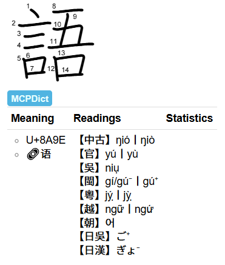

# MCPDìct, MCPDict with Diacritics

A Phonology Dictionary for Yomitan, including pronunciations of Han Characters in:

- Chinese, Middle
- Chinese, Madarin
- Chinese, Wu
- Chinese, Min
- Chinese, Yue
- Vietnamese
- Korean
- Japanese Go-on
- Japanese Kan-on
- Japanese Tō-on
- Japanese Kan'yō-on

etc.

## Features

The most significant feature is that tones are compressed into vowels as diacritics, making the similarities or differences between languages more visible.

For Mandarin (官), Wu (吳), Min (閩), and Yue (粵), the diacritics follow the same rule as below:

1. Dot below vowels (*ạ*) means *light* (陽), and no diacritics below vowels means *dark* (陰).

2. Macron (*ā*) means *level* (平), acute (*á*) means *rising* (上), and grave (*à*) means *departing* (去).

3. *Entering* (入) tones are indicated by the codas *-p*, *-t*, *-k* or *-h*, where *-h* represents the glottal stop.

    3.1. For Yue dialect, where *dark entering* is splitted, dot above vowels (*ȧ*) means *high dark entering* (上陰入), and no diacritics above vowels means *low dark entering* (下陰入).

4. If there are no diacritics above the vowel, nor does it end with *-p*, *-t*, *-k* or *-h*, it technically means *level*, except in Wu dialect it means *departing*, which actually includes *light level*, both *rising*, and both *departing*.

Database comes from [MaigoAkisame/MCPDict](https://github.com/MaigoAkisame/MCPDict).
